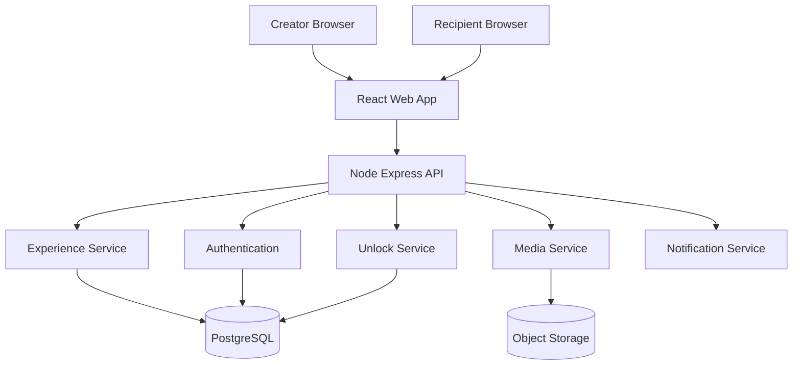

# Personalized Digital Birthday / Anniversary Card

## Staff Software Architect — Master Implementation Prompt

You are a **Staff Software Architect, Senior Product Engineer, UX Engineer, Security Engineer, and QA Lead**.

Build a production-quality web application called:

# "A Letter From Me To You"

It is a private, highly personalized, interactive digital birthday/anniversary experience designed for one person.

The application must feel like a **premium interactive experience**, not a generic greeting-card website.

The core emotional principle is:

> Technology should disappear behind the emotion.

The recipient should feel that someone intentionally created this experience specifically for them.

---

# 1. PRODUCT VISION

Create an interactive digital birthday/anniversary card that takes the recipient through a short emotional journey.

The experience should feel approximately like:

```text
Private Link
    ↓
Envelope / Welcome
    ↓
Opening Animation
    ↓
Personal Greeting
    ↓
Our Memories
    ↓
Interactive Story
    ↓
Photos / Videos
    ↓
Voice Message
    ↓
"Open When..." Messages
    ↓
Future Letter
    ↓
Final Surprise
    ↓
Closing Message
```

The experience should take approximately **5–10 minutes** to explore.

Do NOT create a conventional dashboard-heavy application for the recipient.

The recipient-facing experience should be:

* cinematic
* elegant
* intimate
* responsive
* mobile-first
* accessible
* fast
* emotionally engaging
* subtle rather than cheesy
* highly personalized

---

# 2. PRIMARY USERS

There are two user roles.

## Creator

The person creating the card.

Capabilities:

* create an experience
* configure title
* configure recipient name
* upload photos
* upload videos
* upload audio
* write messages
* create timeline entries
* create "open when" messages
* configure animations
* configure theme
* configure music
* configure final surprise
* preview the experience
* publish/unpublish
* generate private access link
* optionally protect the experience with a PIN

## Recipient

The person receiving the experience.

The recipient should NOT see the administrative interface.

They should receive a private link such as:

```text
https://example.com/e/<unique-token>
```

or:

```text
https://example.com/e/<slug>
```

Optional PIN protection may be enabled.

---

# 3. CORE PRODUCT REQUIREMENTS

## P0 — Must Have

Implement:

1. Private experience creation
2. Recipient name
3. Event type:

   * Birthday
   * Anniversary
   * Valentine's Day
   * Custom
4. Event date
5. Personal greeting
6. Cover image
7. Photo gallery
8. Timeline / memories
9. Background music
10. Personal message
11. Voice message
12. "Open When..." messages
13. Future letter
14. Final surprise
15. Interactive envelope opening
16. Animated transitions
17. Mobile responsive design
18. Preview mode
19. Publish/unpublish
20. Private shareable link
21. Optional PIN protection
22. Creator authentication
23. Secure media handling
24. Automated tests
25. Production-ready deployment configuration

---

# 4. DIFFERENTIATING FEATURES

Do not stop at a standard greeting card.

Implement the following distinctive experiences.

---

## 4.1 Interactive Envelope

The experience begins with an envelope.

Example:

```text
┌─────────────────────────────┐
│                             │
│             💌              │
│                             │
│      A letter for you       │
│                             │
│         [ Open ]            │
│                             │
└─────────────────────────────┘
```

Opening the envelope should trigger a smooth animation.

Avoid excessive animations.

The experience should feel premium.

---

# 4.2 Personalized Opening

After opening:

```text
Hey, [Recipient Name].

I made something for you.

Take a few minutes.
There's no rush.
❤️
```

Allow the creator to configure this text.

---

# 4.3 Interactive Story

Instead of displaying one giant block of text, break the story into chapters.

Example:

```text
Chapter 01
How It Started

Chapter 02
The First Memory

Chapter 03
The Moments I Keep

Chapter 04
What You Mean To Me

Chapter 05
What's Still Ahead
```

The creator can add/remove/reorder chapters.

Each chapter can contain:

* text
* photo
* video
* audio
* quote
* date
* location
* custom CTA

---

# 4.4 Memory Timeline

Create a visual timeline.

Example:

```text
2024
 │
 ├── First Conversation
 │
 ├── First Meeting
 │
 └── First Photo
       │
       ▼
2025
 │
 ├── First Trip
 │
 ├── Birthday
 │
 └── Favorite Memory
       │
       ▼
2026
 │
 └── Today ❤️
```

Each timeline item can contain:

* date
* title
* description
* photo
* audio
* location
* optional song
* optional personal note

---

# 4.5 "Open When..." System

Create multiple locked messages.

Examples:

```text
Open when...

❤️ You miss me
😂 You need to laugh
🥺 You're having a bad day
😴 You can't sleep
🎉 You need motivation
❤️ You need a reminder of us
```

Each message may contain:

* text
* photo
* voice recording
* song
* video

The creator can configure whether a message is:

* immediately available
* date locked
* manually unlocked
* one-time only

---

# 4.6 Voice Letter

Provide a dedicated section:

```text
Don't read this.

Press play instead.

      ▶

A message from me
```

Audio must stream efficiently.

Provide:

* play
* pause
* seek
* duration
* progress
* volume
* mobile support

Do not autoplay audio without explicit user interaction.

---

# 4.7 Music

Allow optional background music.

Requirements:

* play/pause
* mute
* volume
* persistent player
* mobile compatibility
* graceful fallback

Because browsers commonly restrict autoplay, start music only after the recipient interacts with the page.

Support:

1. Uploaded audio
2. External music URL where legally/technically appropriate

Do NOT download copyrighted music automatically.

---

# 4.8 Future Letter

Create a locked future message.

Example:

```text
A message from us,
one year from now.

🔒

This letter opens on:

August 25, 2027
```

Before unlocking:

```text
Not yet.

Some things are worth waiting for.
❤️
```

After unlocking:

```text
You made it.

Now open the letter.
```

The creator should configure:

* unlock date
* title
* message
* optional photo
* optional audio
* optional video

The server must enforce the unlock date.

Do not rely solely on frontend JavaScript.

---

# 4.9 Final Surprise

The final section should be configurable.

Examples:

```text
I have one last thing to ask...

[ Reveal ]
```

After clicking:

```text
Will you go on another adventure with me?
❤️
```

The creator should be able to customize:

* question
* button text
* success message
* animation
* optional image
* optional CTA

Support multiple response types:

* Yes / No
* One button
* Multiple choices
* Custom text response

---

# 4.10 "Choose Your Adventure"

Allow the creator to optionally enable branching.

Example:

```text
Where should we begin?

❤️ Our Story

😂 Funniest Memory

📸 Favorite Photos

🔮 Our Future
```

The recipient's choice determines the next section.

The creator should be able to define the flow.

Represent the experience internally as a directed graph:

```text
Start
  │
  ├── Story
  │     ├── Memory
  │     └── Future
  │
  ├── Photos
  │     └── Voice
  │
  └── Funny Memory
        └── Final Surprise
```

---

# 5. CREATOR ADMIN APPLICATION

Build a separate creator interface.

The creator dashboard should contain:

```text
Dashboard
│
├── Experiences
│
├── Create Experience
│
├── Memories
│
├── Media
│
├── Messages
│
├── Open When
│
├── Theme
│
├── Preview
│
├── Publish
│
└── Settings
```

---

# 6. EXPERIENCE BUILDER

Create a visual editor.

The creator should be able to construct:

```text
Experience
   ↓
Sections
   ↓
Blocks
```

Supported blocks:

* Text
* Heading
* Image
* Gallery
* Video
* Audio
* Timeline
* Quote
* Divider
* Countdown
* Open When
* Future Letter
* Final Question
* Button
* Custom CTA

Each block should support:

* create
* edit
* delete
* duplicate
* reorder
* enable/disable
* preview

Use drag-and-drop if practical.

If drag-and-drop significantly increases complexity, implement accessible up/down controls as fallback.

---

# 7. THEMING

Provide at least five premium themes.

Example:

### Midnight

Dark, elegant, cinematic.

### Paper Love

Warm paper/card aesthetic.

### Minimal

White/cream, typography-focused.

### Sunset

Warm gradients and soft visuals.

### Memory

Scrapbook-inspired but modern.

Avoid childish Valentine's Day aesthetics.

The creator can customize:

* primary color
* secondary color
* background
* typography
* border radius
* animation intensity
* music
* card style

---

# 8. DESIGN SYSTEM

Use a consistent design system.

Define:

* spacing scale
* typography scale
* buttons
* cards
* modal
* dialogs
* inputs
* upload components
* audio player
* timeline
* gallery
* toast
* loading states
* error states

Use design tokens.

Example:

```text
--color-background
--color-surface
--color-primary
--color-text
--color-muted
--radius-sm
--radius-md
--radius-lg
--shadow-sm
--shadow-md
--spacing-xs
--spacing-sm
--spacing-md
--spacing-lg
```

Do not scatter hard-coded styles throughout the application.

---

# 9. TECHNOLOGY STACK

Use the following architecture unless there is a strong technical reason to change it.

## Frontend

* React
* TypeScript
* Vite
* React Router
* CSS Modules or a well-structured CSS architecture
* Framer Motion for animation
* React Hook Form
* Zod
* TanStack Query

Do NOT use Tailwind CSS unless explicitly necessary.

Prefer maintainable semantic CSS.

---

# 10. BACKEND

Use:

* Node.js
* TypeScript
* Express
* REST API
* Zod validation

Architecture:

```text
Controller
   ↓
Service
   ↓
Repository
   ↓
Database
```

Do not put business logic directly in Express route handlers.

---

# 11. DATABASE

Use PostgreSQL.

Use Prisma ORM.

Suggested entities:

```text
User
Experience
ExperienceSection
ContentBlock
Media
Memory
TimelineEntry
OpenWhenMessage
FutureLetter
FinalSurprise
Theme
ExperienceAccess
Response
AuditLog
```

Suggested relationship:

```text
User
 │
 └── Experience
       │
       ├── Sections
       │     └── ContentBlocks
       │
       ├── Media
       │
       ├── Memories
       │
       ├── OpenWhenMessages
       │
       ├── FutureLetters
       │
       ├── FinalSurprise
       │
       └── Theme
```

Use UUIDs.

Add created_at and updated_at where appropriate.

Use database constraints.

Use indexes for:

* user_id
* experience_id
* public token
* unlock date
* published status

---

# 12. MEDIA STORAGE

Do not store large media files directly in PostgreSQL.

Use object storage abstraction.

The application should support:

* local filesystem for development
* S3-compatible storage for production

Recommended abstraction:

```text
MediaStorage
├── LocalMediaStorage
└── S3MediaStorage
```

The application should not depend directly on S3 APIs throughout the codebase.

---

# 13. MEDIA PROCESSING

For uploaded images:

* validate MIME type
* validate extension
* validate file size
* generate optimized version
* generate thumbnail
* strip unnecessary metadata where appropriate

For videos:

* validate MIME
* size limits
* optionally generate thumbnail
* stream rather than loading entire files into memory

For audio:

* validate MIME
* size limits
* stream progressively

Never trust the filename supplied by the client.

---

# 14. SECURITY

Treat the experience as private personal content.

Implement:

## Authentication

Use secure authentication.

Requirements:

* password hashing using Argon2id or bcrypt
* secure sessions or short-lived JWT access tokens
* refresh-token rotation if JWT architecture is used
* logout
* account lock/rate limiting for repeated failed attempts

Never store plaintext passwords.

---

# 15. PRIVATE EXPERIENCE ACCESS

Public recipient links should use high-entropy random tokens.

Example:

```text
/e/8d7f3c0f0b5e...
```

Do NOT use:

```text
/e/123
/e/bibek
/e/birthday
```

Tokens must be:

* cryptographically random
* unguessable
* revocable

Support:

```text
Published
Unpublished
Revoked
PIN protected
```

---

# 16. PIN PROTECTION

If enabled:

```text
Enter PIN

[ • • • • ]

[ Continue ]
```

Implement:

* hashed PIN
* rate limiting
* temporary lockout
* secure verification
* no PIN stored in frontend source
* no PIN returned by API

---

# 17. AUTHORIZATION

Every creator API request must verify ownership.

Never rely on:

```text
/user/:userId/experience/:experienceId
```

alone.

The backend must verify:

```text
authenticated_user owns experience
```

Prevent IDOR vulnerabilities.

---

# 18. INPUT SECURITY

Protect against:

* XSS
* CSRF where applicable
* SQL injection
* path traversal
* malicious uploads
* SSRF
* open redirects
* oversized payloads
* brute-force attacks

Sanitize user-generated HTML.

Prefer plain text/structured rich text instead of arbitrary HTML.

---

# 19. PRIVACY

The application should collect the minimum possible data.

Do not implement invasive analytics.

If analytics are implemented, keep them minimal.

Do not expose:

* creator email
* recipient personal information
* internal IDs
* storage paths
* private metadata

---

# 20. API DESIGN

Create REST APIs similar to:

```text
POST   /api/auth/register
POST   /api/auth/login
POST   /api/auth/logout
GET    /api/me

GET    /api/experiences
POST   /api/experiences
GET    /api/experiences/:id
PATCH  /api/experiences/:id
DELETE /api/experiences/:id

POST   /api/experiences/:id/publish
POST   /api/experiences/:id/unpublish

GET    /api/experiences/:id/sections
POST   /api/experiences/:id/sections
PATCH  /api/sections/:id
DELETE /api/sections/:id

POST   /api/media/upload
DELETE /api/media/:id

GET    /api/experiences/:id/memories
POST   /api/experiences/:id/memories
PATCH  /api/memories/:id
DELETE /api/memories/:id

GET    /api/experiences/:id/open-when
POST   /api/experiences/:id/open-when

GET    /api/experiences/:id/future-letter
PUT    /api/experiences/:id/future-letter

GET    /api/experiences/:id/final-surprise
PUT    /api/experiences/:id/final-surprise
```

Recipient-facing API:

```text
GET  /api/public/experiences/:token
POST /api/public/experiences/:token/verify
POST /api/public/experiences/:token/respond
```

Never expose private creator APIs through the public experience.

---

# 21. API RESPONSE FORMAT

Use consistent responses.

Success:

```json
{
  "success": true,
  "data": {},
  "meta": {}
}
```

Error:

```json
{
  "success": false,
  "error": {
    "code": "EXPERIENCE_NOT_FOUND",
    "message": "Experience not found"
  }
}
```

Do not expose stack traces in production.

---

# 22. FRONTEND ROUTING

Creator:

```text
/login
/register
/dashboard
/experiences
/experiences/new
/experiences/:id/edit
/experiences/:id/preview
/experiences/:id/settings
```

Recipient:

```text
/e/:token
/e/:token/pin
/e/:token/open
```

Keep recipient routes visually independent from the admin application.

---

# 23. RESPONSIVE EXPERIENCE

The recipient experience is **mobile-first**.

Optimize for:

* 320px+
* 375px
* 390px
* 414px
* tablet
* desktop

The experience should work particularly well on a phone because the recipient will probably open it through a messaging app.

---

# 24. ACCESSIBILITY

Implement:

* semantic HTML
* keyboard navigation
* focus states
* screen-reader labels
* reduced-motion support
* sufficient contrast
* accessible dialogs
* accessible buttons
* accessible forms

Respect:

```css
prefers-reduced-motion
```

When reduced motion is enabled, disable unnecessary animations.

---

# 25. PERFORMANCE

Target:

* Lighthouse Performance ≥ 90
* Lighthouse Accessibility ≥ 95
* lazy-loaded images
* responsive image sizes
* optimized media
* code splitting
* route-level lazy loading
* compressed assets
* caching
* CDN-compatible media URLs

Do not load every photo/video/audio asset on initial page load.

---

# 26. ANIMATION PRINCIPLES

Animations should communicate:

* transition
* discovery
* celebration
* emotion

Do not animate everything.

Preferred:

* fade
* slide
* scale
* subtle parallax
* envelope opening
* page transitions
* reveal animations

Avoid:

* excessive bouncing
* spinning hearts everywhere
* aggressive particles
* distracting transitions

The design should feel like:

**Apple-level simplicity + personal scrapbook emotion.**

---

# 27. ACCESSIBLE ERROR STATES

Handle:

```text
Loading
Empty
Error
Unauthorized
Expired
Unpublished
Revoked
PIN required
Future content locked
Media unavailable
Network failure
```

Example:

```text
This memory is temporarily unavailable.

Please try again.
```

Never show technical errors to the recipient.

---

# 28. OFFLINE / PWA

Make the recipient experience installable as a PWA where practical.

Support:

* manifest
* app icon
* splash behavior
* caching of static assets

Do NOT cache private media indefinitely without considering privacy implications.

---

# 29. EXPERIENCE STATES

Experience lifecycle:

```text
DRAFT
  ↓
PREVIEW
  ↓
PUBLISHED
  ↓
UNPUBLISHED
  ↓
REVOKED
```

Only PUBLISHED experiences should be accessible through the recipient link.

---

# 30. PREVIEW MODE

Creator should be able to preview exactly what the recipient will see.

Preview should:

* use production-like rendering
* not expose creator controls
* simulate recipient experience
* support mobile/desktop preview

Provide:

```text
[ Edit ]

[ Preview ]

[ Publish ]
```

---

# 31. SHARE FLOW

After publishing:

```text
Your experience is ready ❤️

[ Copy Private Link ]

[ Preview ]

[ Revoke Link ]
```

Optional:

```text
PIN protection: ON
```

Never expose the raw database ID.

---

# 32. OPTIONAL QR CODE

Generate a QR code for the private experience.

Example:

```text
      █████████
      ██     ██
      ██ QR  ██
      ██     ██
      █████████

Scan to open your surprise ❤️
```

Allow creator to download/print the QR code.

---

# 33. RESPONSE CAPABILITY

If the final question allows a response, save it.

Example:

```text
Question:
"Will you go on another adventure with me?"

Response:
"YES ❤️"
```

Creator dashboard can show:

```text
Final Surprise Response

❤️ YES

Response received:
2026-08-25 20:32
```

Do not expose recipient responses publicly.

---

# 34. EMAIL / NOTIFICATION ARCHITECTURE

Design notification support as an abstraction.

Do not hard-code an email provider.

Create:

```text
NotificationService
├── ConsoleNotificationProvider
└── EmailNotificationProvider
```

For MVP, console provider may be sufficient.

Future providers:

* SMTP
* Resend
* SendGrid
* SES

---

# 35. SCHEDULED UNLOCKS

Future letters and scheduled content must be controlled server-side.

Use a scheduled-job abstraction:

```text
Scheduler
   ↓
UnlockService
   ↓
FutureLetter
```

Do not trust:

```javascript
new Date() > unlockDate
```

on the frontend as the security mechanism.

Frontend may display the countdown, but backend controls access.

---

# 36. AUDIT LOGGING

Track important creator actions:

```text
EXPERIENCE_CREATED
EXPERIENCE_UPDATED
EXPERIENCE_PUBLISHED
EXPERIENCE_UNPUBLISHED
EXPERIENCE_REVOKED
MEDIA_UPLOADED
MEDIA_DELETED
PIN_ENABLED
PIN_DISABLED
```

Never log sensitive content.

---

# 37. TESTING STRATEGY

Implement comprehensive testing.

## Unit tests

Test:

* authentication
* authorization
* experience service
* publish logic
* token generation
* PIN verification
* future-letter unlock
* response handling
* media validation

## Integration tests

Test:

```text
API → Service → Repository → PostgreSQL
```

## Frontend tests

Test:

* envelope opening
* navigation
* gallery
* audio player
* locked content
* future letter
* final surprise
* error states

## E2E

Use Playwright.

Critical flow:

```text
Creator registration
       ↓
Create experience
       ↓
Upload media
       ↓
Configure content
       ↓
Preview
       ↓
Publish
       ↓
Copy private link
       ↓
Open recipient experience
       ↓
Open envelope
       ↓
Explore memories
       ↓
Unlock content
       ↓
Answer final question
       ↓
Creator sees response
```

---

# 38. SECURITY TESTS

Include tests for:

* unauthorized access
* IDOR
* invalid token
* expired token
* revoked token
* incorrect PIN
* brute force PIN attempts
* XSS payloads
* malicious upload
* oversized upload
* invalid MIME type
* path traversal
* unauthorized media access
* API rate limiting

---

# 39. CI/CD

Create GitHub Actions workflows.

Pipeline:

```text
Push / Pull Request
        ↓
Lint
        ↓
Type Check
        ↓
Unit Tests
        ↓
Integration Tests
        ↓
Build
        ↓
E2E
        ↓
Security Checks
        ↓
Docker Build
```

The project must fail CI when:

* lint fails
* type check fails
* tests fail
* build fails

---

# 40. DOCKER

Provide:

```text
Dockerfile
docker-compose.yml
docker-compose.dev.yml
```

Development stack:

```text
Frontend
Backend
PostgreSQL
Object Storage
```

Use an S3-compatible local service such as MinIO if needed.

Provide health checks.

---

# 41. ENVIRONMENT VARIABLES

Create:

```text
.env.example
```

Example categories:

```text
DATABASE_URL=
JWT_SECRET=
SESSION_SECRET=
MEDIA_STORAGE_PROVIDER=
S3_ENDPOINT=
S3_BUCKET=
S3_ACCESS_KEY=
S3_SECRET_KEY=
APP_BASE_URL=
MAX_UPLOAD_SIZE=
```

Never commit real credentials.

---

# 42. LOGGING

Implement structured logging.

Include:

* request ID
* timestamp
* method
* path
* status
* latency

Do not log:

* passwords
* PINs
* authentication tokens
* private media URLs
* personal message contents

---

# 43. OBSERVABILITY

Add a basic abstraction for:

```text
Metrics
Logging
Error Tracking
```

Do not over-engineer this for MVP.

Track useful technical metrics such as:

* API latency
* error rate
* media upload failures
* authentication failures

Avoid invasive recipient tracking.

---

# 44. PROJECT STRUCTURE

Use a clean monorepo:

```text
personal-card/
│
├── apps/
│   ├── web/
│   │   ├── src/
│   │   │   ├── components/
│   │   │   ├── features/
│   │   │   ├── pages/
│   │   │   ├── hooks/
│   │   │   ├── services/
│   │   │   ├── stores/
│   │   │   ├── styles/
│   │   │   └── utils/
│   │   └── package.json
│   │
│   └── api/
│       ├── src/
│       │   ├── controllers/
│       │   ├── services/
│       │   ├── repositories/
│       │   ├── middleware/
│       │   ├── routes/
│       │   ├── validators/
│       │   ├── jobs/
│       │   ├── storage/
│       │   └── utils/
│       └── package.json
│
├── packages/
│   ├── types/
│   ├── validation/
│   └── config/
│
├── prisma/
│   ├── schema.prisma
│   └── migrations/
│
├── tests/
│   └── e2e/
│
├── docker/
├── docs/
├── .github/
│   └── workflows/
│
├── docker-compose.yml
├── package.json
├── pnpm-workspace.yaml
├── README.md
└── .env.example
```

Use a package manager consistently. Prefer pnpm.

---

# 45. CODE QUALITY

Follow:

* SOLID
* DRY
* KISS
* separation of concerns
* dependency inversion where useful
* explicit types
* small modules
* meaningful names

Avoid:

* giant components
* giant Express route files
* duplicated validation
* business logic in React components
* business logic in route handlers
* global mutable state
* magic constants

---

# 46. PRODUCT UX DETAILS

The recipient should never encounter:

* admin UI
* technical terminology
* database IDs
* API errors
* loading spinners everywhere
* unnecessary authentication prompts
* unnecessary forms

The experience should feel intentional.

Use microcopy such as:

```text
Take your time.

There's no hurry.

I made this for you.

Some memories deserve another look.

One more thing...

Not yet. Come back when the time is right.
```

Do not overuse romantic language.

---

# 47. SAMPLE EXPERIENCE

Seed the development database with an example experience.

Example:

```text
Recipient:
Alex

Event:
Birthday

Title:
A Little Something For You

Opening:
"I could have just sent a message...
but where's the fun in that?"

Chapter 1:
How It Started

Chapter 2:
Things I Remember

Chapter 3:
My Favorite Moments

Open When:
"You miss me"

Future Letter:
"Read this next year"

Final Surprise:
"Ready for another adventure?"
```

Use fictional/sample media placeholders.

Do not use copyrighted images in the repository.

---

# 48. UX FLOW

Creator:

```text
Register
 ↓
Dashboard
 ↓
Create Experience
 ↓
Basic Information
 ↓
Choose Theme
 ↓
Add Story
 ↓
Upload Memories
 ↓
Add Voice
 ↓
Add Open-When Messages
 ↓
Configure Future Letter
 ↓
Configure Final Surprise
 ↓
Preview
 ↓
Publish
 ↓
Share
```

Recipient:

```text
Private Link
 ↓
PIN if enabled
 ↓
Envelope
 ↓
Open
 ↓
Welcome
 ↓
Story
 ↓
Memories
 ↓
Voice
 ↓
Open When
 ↓
Future
 ↓
Final Surprise
 ↓
Response
 ↓
Closing
```

---

# 49. FINAL CLOSING EXPERIENCE

After the final interaction:

```text
That's everything.

Except...

there will always be more memories to make.

❤️
```

Allow the creator to customize the closing.

---

# 50. ACCESSIBILITY + EMOTION BALANCE

Do not sacrifice usability for visual effects.

The application should work with:

* mouse
* keyboard
* touch
* screen reader
* reduced motion
* slow connection

---

# 51. PERFORMANCE BUDGET

Target:

```text
Initial JS:
< 250 KB compressed where practical

Largest Contentful Paint:
< 2.5 sec

Cumulative Layout Shift:
< 0.1

Interaction to Next Paint:
< 200 ms where practical
```

Large media must be lazy loaded.

---

# 52. DEVELOPER EXPERIENCE

Provide scripts:

```bash
pnpm install

pnpm dev

pnpm build

pnpm lint

pnpm typecheck

pnpm test

pnpm test:e2e

pnpm db:migrate

pnpm db:seed
```

One command should start the complete local development environment.

---

# 53. DOCUMENTATION

Create:

```text
README.md
docs/architecture.md
docs/api.md
docs/database.md
docs/security.md
docs/deployment.md
docs/testing.md
```

README must include:

* product overview
* architecture
* prerequisites
* installation
* environment variables
* database setup
* local development
* testing
* Docker
* deployment
* troubleshooting

---

# 54. ARCHITECTURE DOCUMENT

Include an architecture diagram.

Use Mermaid.

Example:



---

# 55. IMPORTANT ARCHITECTURAL DECISIONS

Document the reasoning behind:

1. PostgreSQL
2. Prisma
3. REST API
4. object storage
5. token-based private access
6. server-side future unlock validation
7. media abstraction
8. authentication architecture
9. frontend state management
10. PWA strategy

---

# 56. MVP VS FUTURE ROADMAP

Implement MVP first.

## MVP

```text
Authentication
Experience CRUD
Theme
Sections
Photos
Timeline
Audio
Open When
Future Letter
Final Surprise
Preview
Publish
Private URL
PIN
Responsive UI
Testing
Docker
CI
```

## V2

Potential features:

```text
Two-person memories
QR code
Branching story
Advanced animation builder
Email delivery
Scheduled messages
Recipient reactions
Shared editing
Collaborative memories
Memory map
Relationship time machine
AI-assisted writing
AI photo organization
Multi-language support
```

Do NOT implement V2 features unless they are required for the core MVP architecture.

Design the architecture so they can be added later.

---

# 57. AI-ASSISTED FEATURES — OPTIONAL

If implementing AI, keep it optional.

Possible features:

### Memory caption assistant

Input:

```text
"We went to Pokhara and it rained the entire day."
```

AI suggests:

```text
"Somehow the rain made that day even more memorable."
```

### Story organization

Given memories, suggest chronological ordering.

### Message tone

Options:

* playful
* romantic
* sincere
* funny
* minimal

Do NOT send private memories to third-party AI services without explicit creator consent.

Create an abstraction:

```text
AIProvider
├── MockAIProvider
└── ExternalAIProvider
```

---

# 58. ANTI-FEATURES

Do NOT:

* add advertisements
* add social feeds
* add public profiles
* make experiences publicly searchable
* collect unnecessary personal information
* implement invasive tracking
* autoplay audio before interaction
* make the UI excessively pink/red
* fill every screen with hearts
* use generic stock romantic imagery
* create unnecessary microservices
* over-engineer the MVP

---

# 59. DEFINITION OF DONE

The project is complete only when:

### Product

* [ ] Creator can register
* [ ] Creator can create an experience
* [ ] Creator can configure recipient
* [ ] Creator can add story
* [ ] Creator can upload media
* [ ] Creator can add timeline entries
* [ ] Creator can add audio
* [ ] Creator can create Open When messages
* [ ] Creator can create Future Letter
* [ ] Creator can configure Final Surprise
* [ ] Creator can preview
* [ ] Creator can publish
* [ ] Creator receives private link
* [ ] Creator can revoke link

### Recipient

* [ ] Recipient can open private link
* [ ] PIN protection works
* [ ] Envelope animation works
* [ ] Story works
* [ ] Gallery works
* [ ] Timeline works
* [ ] Audio works
* [ ] Open When works
* [ ] Future Letter is date protected
* [ ] Final surprise works
* [ ] Response is recorded
* [ ] Closing experience works

### Engineering

* [ ] TypeScript strict mode
* [ ] Lint passes
* [ ] Type check passes
* [ ] Unit tests pass
* [ ] Integration tests pass
* [ ] Playwright E2E passes
* [ ] Docker build works
* [ ] CI works
* [ ] Security tests pass
* [ ] No secrets committed
* [ ] README is complete

---

# 60. IMPLEMENTATION STRATEGY

Do NOT generate the entire application blindly in one step.

Work in controlled phases.

## Phase 1

Create:

* repository
* monorepo
* frontend
* backend
* PostgreSQL
* Prisma
* Docker
* environment configuration
* basic CI

Run tests.

## Phase 2

Implement:

* authentication
* authorization
* Experience CRUD
* database models

Run tests.

## Phase 3

Implement:

* experience builder
* sections
* blocks
* theme system

Run tests.

## Phase 4

Implement:

* media
* photos
* audio
* video
* storage abstraction

Run tests.

## Phase 5

Implement:

* recipient experience
* envelope
* story
* timeline
* gallery
* music

Run E2E tests.

## Phase 6

Implement:

* Open When
* Future Letter
* Final Surprise
* responses

Run E2E tests.

## Phase 7

Implement:

* PIN
* security hardening
* rate limiting
* privacy
* audit logs

Run security tests.

## Phase 8

Implement:

* performance optimization
* PWA
* accessibility
* deployment
* documentation

Run complete CI.

---

# 61. CRITICAL DEVELOPMENT RULE

After every phase:

1. Run lint.
2. Run type checking.
3. Run unit tests.
4. Run integration tests.
5. Run the application.
6. Verify the feature manually.
7. Fix errors before continuing.
8. Update documentation.
9. Do not leave TODO placeholders for core functionality.

Do not claim a feature is complete if it is only visually mocked.

---

# 62. FINAL QUALITY BAR

The final application should feel like a combination of:

```text
Premium digital greeting card
        +
Interactive story
        +
Private photo album
        +
Mini game
        +
Personal letter
```

It should NOT feel like:

```text
CRUD dashboard
+
generic Bootstrap template
+
random animations
```

The final test is:

> If the creator sends the private link to someone they deeply care about, would the recipient immediately understand that this experience was intentionally made for them?

If the answer is not clearly **yes**, improve the product.

---

# 63. FINAL OUTPUT EXPECTATION

When implementing this specification, produce:

1. Complete source code
2. Complete database schema
3. Database migrations
4. Seed data
5. Frontend
6. Backend
7. Tests
8. Docker configuration
9. CI/CD workflow
10. `.env.example`
11. API documentation
12. Architecture documentation
13. Security documentation
14. Deployment documentation
15. README
16. Sample experience
17. Screenshots or a clear description of the completed UI where supported

The application must be **runnable locally from a clean checkout** using the documented commands.

Do not provide pseudocode for core functionality.

Do not replace real functionality with placeholders.

Do not omit files required to run the application.

When a requirement is ambiguous, choose the simplest production-grade implementation consistent with the architecture and document the decision rather than stopping implementation.

Build the application as a **real product**, not a demo.
