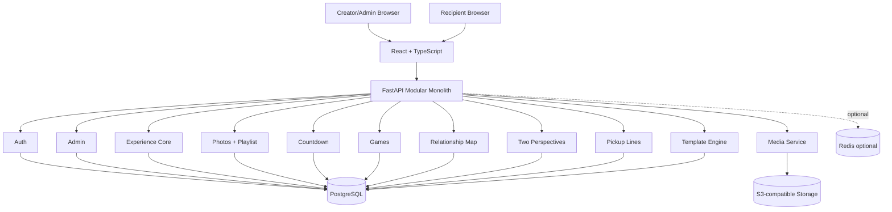

# Architecture

## Decision

Use a **modular monolith** with React frontend and FastAPI backend.

This is superior to six independent applications because the six experiences share:
- identity
- relationship
- media
- templates
- private access
- themes
- responses
- audit
- administration

The modules remain bounded and can later be extracted if scale demands it.

## High-level



## Backend layout

```text
apps/api/
  app/
    core/
    db/
    api/
    modules/
      auth/
      users/
      admin/
      relationships/
      experiences/
      media/
      photos/
      countdown/
      games/
      relationship_map/
      perspectives/
      pickup_lines/
      templates/
      responses/
      notifications/
      audit/
```

## Frontend layout

```text
apps/web/src/
  app/
  routes/
  features/
    auth/
    admin/
    experience-builder/
    recipient/
    photos/
    countdown/
    games/
    relationship-map/
    perspectives/
    pickup-lines/
  components/
  design-system/
  hooks/
  lib/
  services/
```

## Public experience rendering

The public API returns a sanitized experience projection, not raw database objects.

```text
PublicToken
  -> AccessPolicy
  -> ExperienceProjectionService
  -> enabled modules
  -> sanitized blocks
  -> signed media URLs
```

## Template architecture

Each template conforms to a contract:

```text
TemplateDefinition
- id
- module
- name
- personality
- version
- schema
- renderer
- preview
- capabilities
```

Content is data. Presentation is template code.

Never fork an entire page for each template.

## Storage

Local:
- filesystem volume or MinIO

Production:
- AWS S3 or compatible provider

Media metadata stays in PostgreSQL.

## Scheduled unlocks

The frontend countdown is cosmetic.
The API enforces:
`now >= unlock_at`.

A scheduler may precompute notifications, but authorization is always evaluated at request time.

## Extensibility

Future SaaS:
- organization/tenant
- billing
- custom domains
- invitations
- collaboration permissions

Do not add these now, but avoid schemas that prevent them.
